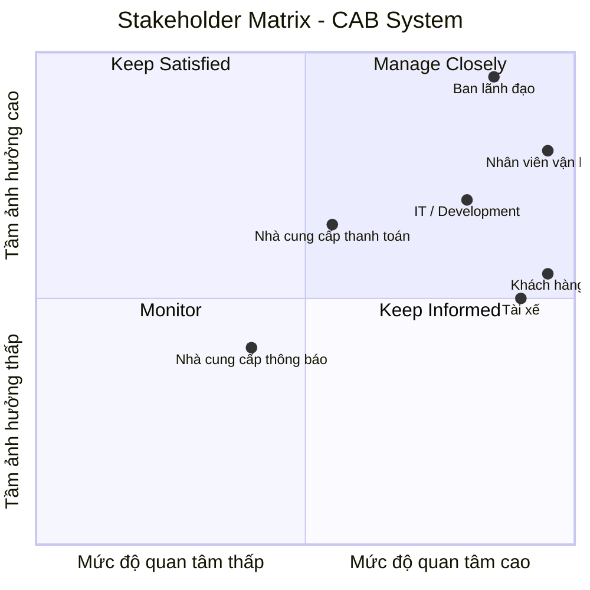
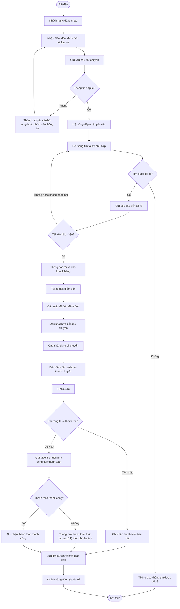
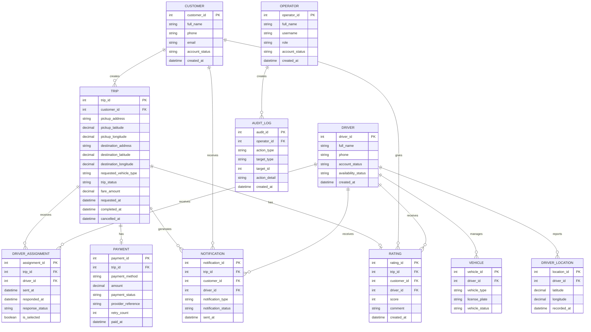
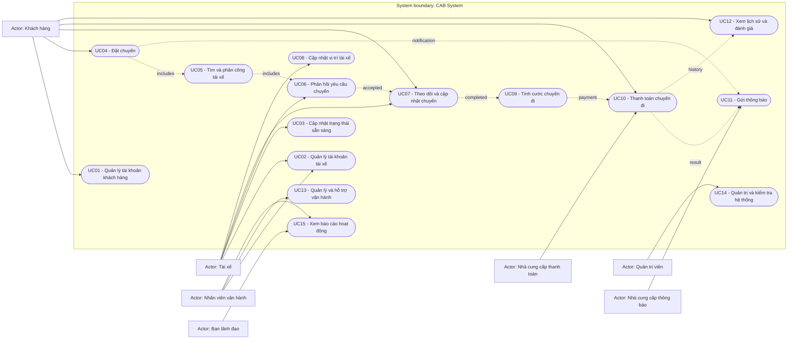

# CAB System
## Business Analysis Document

| Thuộc tính | Nội dung |
| --- | --- |
| Tên dự án | CAB System - Nền tảng đặt xe |
| Khách hàng | Công ty ABC |
| Loại tài liệu | Business Analysis Document |
| Phiên bản | 1.0 |
| Trạng thái | Bản phân tích yêu cầu ban đầu |
| Thời gian triển khai MBB | 7 tuần |

## Mục đích tài liệu

Tài liệu này ghi nhận kết quả phân tích và thiết kế nghiệp vụ ban đầu của Công ty ABC đối với hệ thống CAB. Tài liệu là cơ sở thống nhất bối cảnh nghiệp vụ, nhu cầu kinh doanh, stakeholder, mục tiêu nghiệp vụ, phạm vi, Business Requirements, Functional Requirements, Business Rules, Use Cases và mô hình dữ liệu cho phiên bản MBB.

Các yêu cầu hoặc chỉ tiêu chưa được Công ty ABC xác nhận được ghi nhận tại các mục **Các điểm chưa được xác nhận từ khách hàng** hoặc **Các nội dung cần xác nhận**.

# 1. Phân tích nghiệp vụ

## 1.1. Business Context - Bối cảnh nghiệp vụ

Công ty ABC là doanh nghiệp cung cấp dịch vụ đặt xe trực tuyến. Hiện tại, khách hàng có thể liên hệ với tổng đài hoặc sử dụng một ứng dụng đơn giản để yêu cầu xe. Tuy nhiên, hệ thống hiện tại vẫn còn nhiều hạn chế trong quá trình vận hành.

Việc phân công tài xế chủ yếu được thực hiện thủ công, khách hàng gặp khó khăn trong việc theo dõi trạng thái chuyến đi, thông tin thanh toán chưa được quản lý tập trung và bộ phận vận hành gặp khó khăn khi muốn mở rộng hệ thống.

Trước tình hình đó, ban lãnh đạo Công ty ABC mong muốn xây dựng một nền tảng CAB mới có khả năng phục vụ số lượng lớn khách hàng và tài xế, đồng thời có khả năng phát triển thêm các tính năng trong tương lai.

Hệ thống mới không chỉ được định hướng như một ứng dụng đặt xe đơn thuần mà là một nền tảng hỗ trợ toàn bộ quy trình nghiệp vụ, từ khi khách hàng tạo yêu cầu đặt xe, tìm và phân công tài xế, thực hiện chuyến đi, tính cước, thanh toán, gửi thông báo cho đến đánh giá sau chuyến.

## 1.2. Business Customer và nhu cầu kinh doanh

Business Customer của hệ thống là **Công ty ABC**, đơn vị cung cấp dịch vụ đặt xe trực tuyến.

Công ty ABC mong muốn giải quyết các hạn chế đang tồn tại trong hoạt động đặt xe và vận hành hiện tại. Đồng thời, doanh nghiệp muốn xây dựng một nền tảng có khả năng phục vụ quy mô lớn và có thể tiếp tục mở rộng trong tương lai.

Các nhu cầu chính của doanh nghiệp bao gồm:

* Tự động hóa quá trình tìm và phân công tài xế.
* Hỗ trợ khách hàng theo dõi trạng thái chuyến đi.
* Hỗ trợ tính cước và thanh toán.
* Quản lý thông tin và giao dịch tập trung.
* Hỗ trợ nhân viên vận hành quản lý khách hàng, tài xế, phương tiện và chuyến đi.
* Cung cấp dữ liệu phục vụ báo cáo và theo dõi hoạt động kinh doanh.
* Đảm bảo bảo mật, phân quyền và lưu vết các thao tác quan trọng.
* Đảm bảo khả năng mở rộng khi số lượng người dùng và tải hệ thống tăng.
* Cho phép bổ sung loại dịch vụ, phương thức thanh toán và nhà cung cấp thông báo trong tương lai.

## 1.3. Phân tích vấn đề nghiệp vụ hiện tại

Qua phân tích yêu cầu ban đầu, có thể xác định các vấn đề chính của doanh nghiệp như sau.

### 1.3.1. Phân công tài xế còn phụ thuộc vào thao tác thủ công

Việc phân công tài xế hiện chủ yếu được thực hiện thủ công. Khi số lượng khách hàng, tài xế và chuyến đi tăng lên, cách thức này sẽ làm tăng khối lượng công việc cho bộ phận vận hành và gây khó khăn trong việc mở rộng quy mô dịch vụ.

Do đó, hệ thống mới cần có khả năng xác định các tài xế phù hợp dựa trên vị trí, trạng thái sẵn sàng và các tiêu chí vận hành khác. Nếu tài xế được đề xuất không phản hồi hoặc từ chối chuyến, hệ thống cần tiếp tục tìm tài xế khác mà không yêu cầu khách hàng tạo lại yêu cầu.

### 1.3.2. Khách hàng khó theo dõi trạng thái chuyến đi

Hệ thống hiện tại chưa đáp ứng tốt nhu cầu theo dõi chuyến của khách hàng.

Khách hàng cần biết hệ thống đang tìm tài xế, tài xế nào đã nhận chuyến, thời gian dự kiến tài xế đến và trạng thái hiện tại của chuyến. Trong quá trình thực hiện chuyến, trạng thái cần được cập nhật từ lúc tài xế đến điểm đón, đón khách, đang di chuyển cho đến khi hoàn thành chuyến.

### 1.3.3. Thanh toán chưa được quản lý tập trung

Thông tin thanh toán hiện chưa được quản lý tập trung. Hệ thống mới cần hỗ trợ tính cước dựa trên loại dịch vụ và thông tin chuyến đi, đồng thời hỗ trợ cả thanh toán tiền mặt và thanh toán điện tử.

Doanh nghiệp muốn tích hợp với nhà cung cấp thanh toán bên ngoài và không muốn lưu trực tiếp thông tin nhạy cảm của thẻ hoặc tài khoản thanh toán trong hệ thống CAB. Hệ thống cũng cần có cơ chế thông báo và xử lý lại khi giao dịch thanh toán điện tử thất bại.

### 1.3.4. Hệ thống hiện tại khó mở rộng

Doanh nghiệp muốn phục vụ số lượng lớn khách hàng và tài xế, đồng thời tiếp tục phát triển các dịch vụ trong tương lai. Vì vậy, hệ thống cần có khả năng mở rộng độc lập khi tải tăng và cho phép triển khai từng phần mà hạn chế ảnh hưởng đến các chức năng đang hoạt động.

Ngoài ra, hệ thống cần đủ linh hoạt để có thể bổ sung loại dịch vụ mới, phương thức thanh toán mới, nhà cung cấp thông báo mới hoặc thay đổi một số thành phần kỹ thuật mà không phải xây dựng lại toàn bộ ứng dụng.

## 1.4. Business Need - Nhu cầu xây dựng hệ thống mới

Hệ thống hiện tại không còn đáp ứng đầy đủ nhu cầu vận hành và định hướng phát triển của Công ty ABC.

Khoảng cách giữa khả năng hiện tại và nhu cầu của doanh nghiệp thể hiện ở các vấn đề:

| Hiện trạng | Hạn chế | Ảnh hưởng |
| --- | --- | --- |
| Phân công tài xế chủ yếu thủ công | Chưa có cơ chế tự động tìm và phân công tài xế | Tăng khối lượng vận hành và khó mở rộng |
| Khách hàng khó theo dõi chuyến | Thiếu khả năng theo dõi trạng thái chuyến | Ảnh hưởng trải nghiệm khách hàng |
| Thanh toán chưa tập trung | Chưa có quy trình quản lý thanh toán thống nhất | Khó kiểm soát giao dịch |
| Hệ thống khó mở rộng | Chưa đáp ứng tốt nhu cầu tăng tải và phát triển lâu dài | Hạn chế khả năng mở rộng |
| Khả năng mở rộng thông báo hạn chế | Cần hỗ trợ nhiều nhà cung cấp/kênh thông báo | Khó phát triển trong tương lai |

Vì vậy, việc xây dựng hệ thống mới không chỉ nhằm thay thế ứng dụng hiện tại mà nhằm tạo ra một **nền tảng CAB có khả năng hỗ trợ toàn bộ quy trình đặt xe, nâng cao hiệu quả vận hành và đáp ứng định hướng phát triển lâu dài của doanh nghiệp**.

## 1.5. Business Goals - Mục tiêu nghiệp vụ

| Mã | Business Goal | Mô tả |
| --- | --- | --- |
| BG01 | Xây dựng hệ thống cơ bản/MBB để demo | Có phiên bản mẫu tối thiểu với các chức năng cần thiết để trình diễn cho khách hàng |
| BG02 | Tự động hóa tìm và phân công tài xế | Giảm phụ thuộc vào thao tác thủ công và tiếp tục tìm tài xế khác khi cần |
| BG03 | Nâng cao khả năng theo dõi chuyến đi | Giúp khách hàng theo dõi tài xế, thời gian đến dự kiến và trạng thái chuyến |
| BG04 | Hỗ trợ tính cước và thanh toán | Hỗ trợ thanh toán tiền mặt, thanh toán điện tử và quản lý kết quả giao dịch |
| BG05 | Quản lý tập trung hoạt động đặt xe | Quản lý khách hàng, tài xế, phương tiện, chuyến đi và giao dịch |
| BG06 | Hỗ trợ vận hành và xử lý sự cố | Cho phép nhân viên theo dõi chuyến, trạng thái tài xế và các chuyến bị lỗi |
| BG07 | Cung cấp dữ liệu phục vụ quản lý | Hỗ trợ báo cáo về số chuyến, doanh thu, tỷ lệ hoàn thành, tỷ lệ hủy và hiệu quả tài xế |
| BG08 | Đảm bảo bảo mật và kiểm soát truy cập | Xác thực, phân quyền, bảo vệ dữ liệu và lưu vết các thao tác quan trọng |
| BG09 | Đảm bảo khả năng mở rộng và ổn định | Hỗ trợ số lượng lớn người dùng và hạn chế ảnh hưởng khi thanh toán hoặc thông báo gặp lỗi |
| BG10 | Tạo nền tảng phát triển trong tương lai | Cho phép bổ sung dịch vụ, phương thức thanh toán và nhà cung cấp thông báo |

## 1.6. Open Issues - Các điểm chưa được xác nhận từ khách hàng

Một số nội dung nghiệp vụ trong yêu cầu ban đầu chưa có thông tin hoặc chính sách cụ thể. Các nội dung này cần được Business Analyst làm rõ với các bên liên quan trước khi nhóm phát triển triển khai.

Các vấn đề gồm:

* Cách tính cước.
* Tiêu chí ưu tiên và lựa chọn tài xế.
* Thời gian tài xế phải phản hồi yêu cầu.
* Chính sách hủy chuyến.
* Cách xử lý khi mất kết nối mạng.
* Thời gian lưu trữ dữ liệu.

Các nội dung trên không được xem là yêu cầu đã chốt. Trong trường hợp cần xây dựng luồng MBB để demo, BA có thể đề xuất quy tắc thiết kế tại Mục 7 và phải ghi rõ trạng thái **Thiết kế MBB** để phân biệt với yêu cầu đã được khách hàng phê duyệt.

# 2. Stakeholder Analysis - Phân tích stakeholder

## 2.1. Danh sách Stakeholder

| Tên Stakeholder | Vai trò |
| --- | --- |
| Ban lãnh đạo Công ty ABC | Định hướng và quyết định mục tiêu kinh doanh của hệ thống; theo dõi báo cáo về số lượng chuyến, doanh thu, tỷ lệ hoàn thành, tỷ lệ hủy và hiệu quả hoạt động của tài xế. |
| Khách hàng | Người sử dụng dịch vụ đặt xe; đăng ký tài khoản, đặt xe, theo dõi chuyến đi, xem lịch sử, thanh toán và đánh giá tài xế. |
| Tài xế | Người thực hiện dịch vụ vận chuyển; quản lý hồ sơ và phương tiện, nhận hoặc từ chối chuyến, cập nhật trạng thái chuyến và cung cấp thông tin vị trí. |
| Nhân viên vận hành | Quản lý và hỗ trợ hoạt động đặt xe; quản lý khách hàng, tài xế, phương tiện và chuyến đi; theo dõi chuyến đang diễn ra, xử lý trường hợp lỗi và tra cứu lịch sử giao dịch. |
| Nhà cung cấp thanh toán | Cung cấp dịch vụ thanh toán điện tử và xử lý giao dịch thanh toán thông qua hệ thống bên ngoài. |
| Nhà cung cấp dịch vụ thông báo | Cung cấp các kênh gửi thông báo đến khách hàng và tài xế, đồng thời hỗ trợ khả năng mở rộng thêm các kênh thông báo trong tương lai. |
| Đội ngũ IT / Development | Xây dựng, triển khai, bảo trì và đảm bảo hệ thống đáp ứng các yêu cầu về khả năng mở rộng, bảo mật và tích hợp. |

Các stakeholder trên được xác định dựa trên các nhóm người dùng, yêu cầu vận hành, yêu cầu báo cáo, thanh toán, thông báo và yêu cầu kỹ thuật được nêu trong tài liệu khách hàng.

## 2.2. Stakeholder Matrix

Ma trận Stakeholder được xây dựng dựa trên hai tiêu chí:

* **Power:** Mức độ ảnh hưởng của stakeholder đến quyết định, phạm vi và hướng phát triển của hệ thống.
* **Interest:** Mức độ quan tâm của stakeholder đối với hệ thống và kết quả của dự án.

## 2.3. Phân loại Stakeholder

### Manage Closely - Tầm ảnh hưởng cao, mức độ quan tâm cao

* Ban lãnh đạo.
* Nhân viên vận hành.
* Đội ngũ IT / Development.

Đây là các stakeholder cần được trao đổi thường xuyên vì có ảnh hưởng lớn đến mục tiêu kinh doanh, hoạt động vận hành và việc triển khai hệ thống.

### Keep Satisfied - Tầm ảnh hưởng cao, mức độ quan tâm tương đối

* Nhà cung cấp thanh toán.

Stakeholder này có ảnh hưởng trực tiếp đến khả năng thanh toán điện tử của hệ thống và cần được phối hợp trong quá trình tích hợp.

### Keep Informed - Tầm ảnh hưởng thấp hơn, mức độ quan tâm cao

* Khách hàng.
* Tài xế.

Đây là các nhóm sử dụng dịch vụ và hệ thống trực tiếp, do đó cần thường xuyên thu thập phản hồi để đảm bảo hệ thống đáp ứng đúng nhu cầu thực tế.

### Monitor - Tầm ảnh hưởng và mức độ quan tâm tương đối thấp

* Nhà cung cấp dịch vụ thông báo.

Stakeholder này cần được theo dõi và đảm bảo khả năng tích hợp linh hoạt, vì doanh nghiệp mong muốn có thể bổ sung hoặc thay đổi nhà cung cấp thông báo trong tương lai.

# 3. Scope - Phạm vi yêu cầu

## 3.1. Phạm vi thực hiện

### 3.1.1. Đối với khách hàng

* Đăng ký tài khoản và đăng nhập.
* Cập nhật thông tin cá nhân.
* Nhập điểm đón và điểm đến.
* Lựa chọn loại xe.
* Gửi yêu cầu đặt xe.
* Theo dõi trạng thái hệ thống đang tìm tài xế.
* Biết tài xế đã nhận chuyến và thời gian dự kiến tài xế đến.
* Theo dõi trạng thái chuyến từ lúc tài xế đến điểm đón, đón khách, đang di chuyển đến khi hoàn thành.
* Xem lịch sử chuyến đi và số tiền phải trả.
* Thanh toán bằng tiền mặt hoặc phương thức điện tử được tích hợp.
* Đánh giá tài xế sau khi hoàn thành chuyến.

### 3.1.2. Đối với tài xế

* Đăng ký hoặc được nhân viên vận hành tạo tài khoản.
* Cập nhật hồ sơ cá nhân và thông tin phương tiện.
* Cập nhật trạng thái hoạt động và trạng thái sẵn sàng nhận chuyến.
* Nhận thông báo về yêu cầu chuyến phù hợp.
* Chấp nhận hoặc từ chối chuyến.
* Cập nhật trạng thái đã đến điểm đón, đã đón khách, đang di chuyển và hoàn thành chuyến.
* Cung cấp thông tin vị trí để hỗ trợ tìm tài xế gần khách hàng và ước tính thời gian đến.

### 3.1.3. Đối với hệ thống điều phối

* Xác định tài xế phù hợp dựa trên vị trí, trạng thái sẵn sàng và các tiêu chí vận hành được khách hàng xác nhận.
* Ưu tiên tài xế phù hợp và gần khách hàng.
* Tiếp tục tìm tài xế khác khi tài xế được đề xuất không phản hồi hoặc từ chối chuyến.
* Thông báo rõ ràng cho khách hàng khi không tìm được tài xế.

### 3.1.4. Đối với thanh toán và thông báo

* Tính số tiền khách hàng phải trả sau khi chuyến đi hoàn thành dựa trên loại dịch vụ và thông tin chuyến đi.
* Hỗ trợ thanh toán tiền mặt và thanh toán điện tử.
* Tích hợp với nhà cung cấp thanh toán bên ngoài.
* Không lưu trực tiếp thông tin nhạy cảm của thẻ hoặc tài khoản thanh toán trong hệ thống CAB.
* Thông báo cho khách hàng về việc tiếp nhận yêu cầu, tài xế nhận chuyến, tài xế đến điểm đón, chuyến hoàn thành và kết quả thanh toán.
* Thông báo cho tài xế về chuyến mới hoặc thay đổi liên quan đến chuyến đang thực hiện.

### 3.1.5. Đối với nhân viên vận hành

* Quản lý khách hàng, tài xế, phương tiện và chuyến đi.
* Xem các chuyến đang diễn ra.
* Kiểm tra trạng thái tài xế.
* Hỗ trợ xử lý các trường hợp chuyến bị lỗi.
* Tra cứu lịch sử giao dịch.
* Sử dụng các chức năng quản trị theo quyền được phân công.
* Theo dõi báo cáo về số lượng chuyến, doanh thu, tỷ lệ hoàn thành, tỷ lệ hủy và hiệu quả hoạt động của tài xế.

### 3.1.6. Yêu cầu chung về bảo mật và vận hành

* Khách hàng và tài xế phải được xác thực trước khi sử dụng chức năng yêu cầu tài khoản.
* Thao tác quản trị phải được kiểm soát bằng quyền truy cập.
* Thông tin cá nhân, thông tin phương tiện, dữ liệu vị trí và dữ liệu giao dịch phải được bảo vệ.
* Các thao tác quan trọng phải được lưu vết để phục vụ kiểm tra khi có sự cố.
* Hệ thống phải hạn chế việc lỗi ở thanh toán hoặc thông báo làm ảnh hưởng đến toàn bộ chức năng đặt xe.

# 4. Business Requirements - Yêu cầu nghiệp vụ

Các yêu cầu dưới đây được chuyển đổi từ nhu cầu nghiệp vụ và phạm vi hoạt động của hệ thống CAB. Mỗi yêu cầu được gán một mã **BR** để sử dụng trong các bước phân tích, thiết kế, phát triển và kiểm thử.

| Mã | Tên Business Requirement | Diễn giải |
| --- | --- | --- |
| BR01 | Đặt chuyến | Khách hàng có thể tạo yêu cầu đặt xe; cung cấp điểm đón, điểm đến và lựa chọn loại xe trước khi gửi yêu cầu. |
| BR02 | Quản lý tài khoản khách hàng | Khách hàng có thể đăng ký tài khoản, đăng nhập và cập nhật thông tin cá nhân để sử dụng dịch vụ đặt xe. |
| BR03 | Quản lý tài khoản và phương tiện tài xế | Tài xế có thể đăng ký hoặc được nhân viên vận hành tạo tài khoản; cập nhật hồ sơ, thông tin phương tiện và trạng thái hoạt động. |
| BR04 | Tìm kiếm và phân công tài xế | Hệ thống xác định tài xế phù hợp dựa trên vị trí, trạng thái sẵn sàng và các tiêu chí vận hành đã được xác nhận; ưu tiên tài xế phù hợp và gần khách hàng. |
| BR05 | Xử lý phản hồi của tài xế | Hệ thống gửi yêu cầu đến tài xế; tài xế có thể chấp nhận hoặc từ chối. Khi tài xế không phản hồi hoặc từ chối, hệ thống tiếp tục tìm tài xế khác mà khách hàng không phải tạo lại yêu cầu. |
| BR06 | Theo dõi trạng thái chuyến | Khách hàng có thể theo dõi trạng thái từ lúc hệ thống tìm tài xế, tài xế nhận chuyến, tài xế đến điểm đón, đã đón khách, đang di chuyển đến khi hoàn thành chuyến. |
| BR07 | Cập nhật vị trí tài xế | Hệ thống lưu thông tin vị trí của tài xế để hỗ trợ tìm tài xế gần khách hàng và cung cấp thời gian dự kiến tài xế đến. |
| BR08 | Tính cước chuyến đi | Sau khi chuyến đi hoàn thành, hệ thống xác định số tiền khách hàng phải trả dựa trên loại dịch vụ và thông tin chuyến đi. |
| BR09 | Thanh toán chuyến đi | Khách hàng có thể thanh toán bằng tiền mặt hoặc thanh toán điện tử thông qua nhà cung cấp bên ngoài; hệ thống không lưu trực tiếp thông tin nhạy cảm của thẻ hoặc tài khoản thanh toán. |
| BR10 | Quản lý giao dịch thanh toán | Hệ thống ghi nhận kết quả thanh toán, thông báo cho khách hàng và hỗ trợ xử lý lại khi giao dịch thanh toán điện tử thất bại theo chính sách được Công ty ABC xác nhận. |
| BR11 | Gửi thông báo | Hệ thống gửi thông báo cho khách hàng khi yêu cầu được tiếp nhận, có tài xế nhận chuyến, tài xế đến điểm đón, chuyến hoàn thành và thanh toán có kết quả; đồng thời thông báo cho tài xế về chuyến mới hoặc thay đổi liên quan. |
| BR12 | Quản lý lịch sử và đánh giá | Khách hàng có thể xem lịch sử chuyến đi, số tiền phải trả và đánh giá tài xế sau khi chuyến hoàn thành. |
| BR13 | Quản lý hoạt động vận hành | Nhân viên vận hành có thể quản lý khách hàng, tài xế, phương tiện và chuyến đi; xem chuyến đang diễn ra, kiểm tra trạng thái tài xế và tra cứu lịch sử giao dịch. |
| BR14 | Xử lý chuyến bị lỗi | Nhân viên vận hành có thể kiểm tra và hỗ trợ xử lý các trường hợp chuyến đi bị lỗi trong quá trình vận hành. |
| BR15 | Báo cáo hoạt động kinh doanh | Hệ thống cung cấp báo cáo về số lượng chuyến, doanh thu, tỷ lệ hoàn thành, tỷ lệ hủy và hiệu quả hoạt động của tài xế. |
| BR16 | Bảo mật và phân quyền | Hệ thống xác thực khách hàng và tài xế; kiểm soát quyền truy cập đối với chức năng quản trị; bảo vệ dữ liệu cá nhân, phương tiện, vị trí và giao dịch. |
| BR17 | Lưu vết thao tác | Hệ thống lưu vết các thao tác quan trọng để phục vụ kiểm tra và xử lý khi có sự cố. |
| BR18 | Khả năng mở rộng hệ thống | Hệ thống có khả năng phục vụ số lượng lớn khách hàng và tài xế, mở rộng độc lập khi tải tăng và bổ sung loại dịch vụ, phương thức thanh toán hoặc nhà cung cấp thông báo trong tương lai. |

# 5. Business Process - Quy trình đặt chuyến

## 5.1. Mục đích quy trình

Quy trình đặt chuyến mô tả trình tự nghiệp vụ từ khi khách hàng tạo yêu cầu đến khi chuyến hoàn thành, thanh toán và đánh giá. Quy trình xác định trách nhiệm của khách hàng, hệ thống CAB, tài xế, nhà cung cấp thanh toán và nhân viên vận hành.

Quy trình được xây dựng cho phiên bản MBB, tập trung vào luồng nghiệp vụ chính của nền tảng đặt xe trực tuyến. Các chính sách chi tiết được phân biệt giữa yêu cầu khách hàng và đề xuất thiết kế MBB tại Mục 7 và Mục 8.

## 5.2. Tác nhân tham gia

| Tác nhân | Trách nhiệm trong quy trình |
| --- | --- |
| Khách hàng | Nhập thông tin chuyến, gửi yêu cầu, theo dõi trạng thái, thanh toán và đánh giá tài xế |
| CAB System | Tiếp nhận yêu cầu, tìm tài xế, cập nhật trạng thái, tính cước, gửi thông báo và lưu lịch sử |
| Tài xế | Nhận hoặc từ chối chuyến, di chuyển đến điểm đón, thực hiện chuyến và cập nhật trạng thái |
| Nhà cung cấp thanh toán | Xử lý giao dịch thanh toán điện tử và trả kết quả giao dịch cho hệ thống |
| Nhân viên vận hành | Theo dõi chuyến, hỗ trợ điều phối và xử lý các trường hợp chuyến bị lỗi |

## 5.3. Luồng nghiệp vụ chính

| Bước | Tác nhân | Hoạt động nghiệp vụ | Kết quả/Trạng thái |
| --- | --- | --- | --- |
| 1 | Khách hàng | Đăng nhập vào hệ thống và chọn chức năng đặt chuyến | Khách hàng được phép tạo yêu cầu |
| 2 | Khách hàng | Nhập điểm đón, điểm đến và lựa chọn loại xe | Thông tin chuyến được nhập đầy đủ |
| 3 | CAB System | Kiểm tra thông tin yêu cầu và tiếp nhận yêu cầu đặt chuyến | Trạng thái: **Đã tiếp nhận yêu cầu** |
| 4 | CAB System | Xác định các tài xế phù hợp dựa trên vị trí, trạng thái sẵn sàng và tiêu chí vận hành đã được xác nhận | Trạng thái: **Đang tìm tài xế** |
| 5 | CAB System | Gửi thông báo yêu cầu chuyến đến tài xế phù hợp | Tài xế nhận được yêu cầu chuyến |
| 6 | Tài xế | Xem thông tin chuyến và chọn chấp nhận hoặc từ chối | Hệ thống nhận được phản hồi của tài xế |
| 7 | CAB System | Ghi nhận tài xế chấp nhận chuyến và thông báo cho khách hàng | Trạng thái: **Đã có tài xế nhận chuyến** |
| 8 | Tài xế | Di chuyển đến điểm đón và cập nhật trạng thái đã đến | Trạng thái: **Tài xế đã đến điểm đón** |
| 9 | Tài xế | Đón khách và cập nhật trạng thái chuyến | Trạng thái: **Đã đón khách** |
| 10 | Tài xế | Thực hiện chuyến đi và cập nhật trạng thái đang di chuyển | Trạng thái: **Đang di chuyển** |
| 11 | Tài xế | Đến điểm đến và xác nhận hoàn thành chuyến | Trạng thái: **Hoàn thành chuyến** |
| 12 | CAB System | Tính cước dựa trên loại dịch vụ và thông tin chuyến đi | Hệ thống xác định số tiền khách hàng phải trả |
| 13 | Khách hàng | Thanh toán bằng tiền mặt hoặc phương thức thanh toán điện tử | Giao dịch được ghi nhận |
| 14 | CAB System | Gửi kết quả thanh toán, lưu lịch sử chuyến và giao dịch | Chuyến đi có đầy đủ thông tin kết thúc |
| 15 | Khách hàng | Đánh giá tài xế sau khi hoàn thành chuyến | Đánh giá được lưu vào lịch sử chuyến |

## 5.4. Sơ đồ quy trình đặt chuyến

## 5.5. Các luồng thay thế và ngoại lệ

| Mã | Tình huống | Cách xử lý nghiệp vụ |
| --- | --- | --- |
| AF01 | Thông tin điểm đón, điểm đến hoặc loại xe chưa đầy đủ | Hệ thống không tiếp nhận yêu cầu và yêu cầu khách hàng bổ sung thông tin |
| AF02 | Không tìm thấy tài xế phù hợp | Hệ thống thông báo rõ ràng cho khách hàng; yêu cầu kết thúc ở trạng thái không tìm được tài xế |
| AF03 | Tài xế từ chối hoặc không phản hồi | Hệ thống tiếp tục tìm tài xế khác; khách hàng không phải tạo lại yêu cầu |
| AF04 | Tài xế cập nhật trạng thái chuyến không đúng trình tự | Hệ thống không cho chuyển trạng thái không hợp lệ và ghi nhận sự kiện để hỗ trợ vận hành |
| AF05 | Thanh toán điện tử thất bại | Hệ thống thông báo kết quả cho khách hàng, ghi nhận giao dịch thất bại và xử lý lại theo chính sách được ABC xác nhận |
| AF06 | Có lỗi trong chuyến đang diễn ra | Nhân viên vận hành kiểm tra thông tin chuyến và hỗ trợ xử lý theo quy trình vận hành |

## 5.6. Kết quả đầu ra của quy trình

Khi quy trình hoàn tất, hệ thống phải lưu được thông tin yêu cầu đặt chuyến, khách hàng, tài xế, phương tiện, các trạng thái chuyến, số tiền phải trả, kết quả thanh toán và đánh giá của khách hàng. Trường hợp quy trình không hoàn tất, hệ thống phải lưu trạng thái kết thúc tương ứng và thông báo cho khách hàng hoặc nhân viên vận hành theo tình huống.

# 6. Functional Requirements - Yêu cầu chức năng

## 6.1. Mục đích phân rã

Functional Requirements (FR) là các yêu cầu chức năng được phân rã từ Business Requirements (BR) và Business Process. FR mô tả hành vi hệ thống phải thực hiện để đáp ứng yêu cầu nghiệp vụ đã xác định.

Các FR dưới đây chỉ cụ thể hóa những nội dung đã có trong BR và quy trình đặt chuyến. Không bổ sung loại dịch vụ, chính sách giá, chính sách hủy, thời gian phản hồi hoặc logic nghiệp vụ mới chưa được Công ty ABC xác nhận.

## 6.2. Danh sách Functional Requirements

| Mã FR | Tên Functional Requirement | Diễn giải | BR liên kết |
| --- | --- | --- | --- |
| FR01 | Đăng ký tài khoản khách hàng | Hệ thống cho phép khách hàng tạo tài khoản để sử dụng các chức năng yêu cầu tài khoản. | BR02 |
| FR02 | Đăng nhập khách hàng | Hệ thống cho phép khách hàng đăng nhập trước khi sử dụng chức năng đặt chuyến. | BR02, BR16 |
| FR03 | Cập nhật thông tin khách hàng | Hệ thống cho phép khách hàng cập nhật thông tin cá nhân. | BR02 |
| FR04 | Cung cấp thông tin đặt chuyến | Hệ thống cho phép khách hàng nhập điểm đón, điểm đến và lựa chọn loại xe. | BR01 |
| FR05 | Tạo yêu cầu đặt chuyến | Hệ thống tiếp nhận yêu cầu đặt chuyến sau khi khách hàng cung cấp đầy đủ thông tin cần thiết. | BR01 |
| FR06 | Kiểm tra thông tin đặt chuyến | Hệ thống kiểm tra thông tin điểm đón, điểm đến và loại xe trước khi tiếp nhận yêu cầu. Nếu thông tin chưa đầy đủ, hệ thống yêu cầu khách hàng bổ sung hoặc chỉnh sửa. | BR01 |
| FR07 | Hiển thị trạng thái tiếp nhận yêu cầu | Hệ thống cập nhật và hiển thị trạng thái yêu cầu sau khi tiếp nhận thành công. | BR01, BR06, BR11 |
| FR08 | Đăng ký hoặc tạo tài khoản tài xế | Hệ thống cho phép tài xế đăng ký hoặc cho phép nhân viên vận hành tạo tài khoản tài xế. | BR03 |
| FR09 | Cập nhật hồ sơ và phương tiện tài xế | Hệ thống cho phép cập nhật hồ sơ cá nhân và thông tin phương tiện của tài xế. | BR03 |
| FR10 | Cập nhật trạng thái sẵn sàng | Hệ thống cho phép tài xế cập nhật trạng thái hoạt động và trạng thái sẵn sàng nhận chuyến. | BR03, BR04 |
| FR11 | Xác định tài xế phù hợp | Hệ thống xác định tài xế dựa trên vị trí, trạng thái sẵn sàng và các tiêu chí vận hành đã được xác nhận. | BR04 |
| FR12 | Ưu tiên tài xế phù hợp và gần khách hàng | Hệ thống ưu tiên tài xế phù hợp và gần điểm đón trong quá trình tìm kiếm. | BR04 |
| FR13 | Gửi yêu cầu chuyến đến tài xế | Hệ thống gửi thông tin yêu cầu chuyến đến tài xế phù hợp. | BR05, BR11 |
| FR14 | Tiếp nhận phản hồi của tài xế | Hệ thống ghi nhận lựa chọn chấp nhận hoặc từ chối chuyến của tài xế. | BR05 |
| FR15 | Tìm tài xế thay thế | Khi tài xế từ chối hoặc không phản hồi, hệ thống tiếp tục tìm tài xế khác mà không yêu cầu khách hàng tạo lại yêu cầu. | BR05 |
| FR16 | Thông báo không tìm được tài xế | Khi không tìm được tài xế phù hợp, hệ thống thông báo rõ ràng cho khách hàng và kết thúc yêu cầu theo trạng thái tương ứng. | BR04, BR05, BR11 |
| FR17 | Ghi nhận tài xế nhận chuyến | Khi tài xế chấp nhận, hệ thống ghi nhận tài xế cho chuyến và cập nhật trạng thái chuyến. | BR05, BR06 |
| FR18 | Hiển thị thông tin tài xế và thời gian dự kiến | Hệ thống cung cấp cho khách hàng thông tin tài xế đã nhận chuyến và thời gian dự kiến tài xế đến. | BR06, BR07 |
| FR19 | Cập nhật vị trí tài xế | Hệ thống tiếp nhận và lưu thông tin vị trí tài xế phục vụ việc tìm tài xế gần khách hàng và ước tính thời gian đến. | BR07 |
| FR20 | Cập nhật trạng thái đã đến điểm đón | Hệ thống cho phép tài xế cập nhật trạng thái đã đến điểm đón và hiển thị trạng thái này cho khách hàng. | BR06, BR11 |
| FR21 | Cập nhật trạng thái đã đón khách | Hệ thống cho phép tài xế cập nhật trạng thái đã đón khách. | BR06 |
| FR22 | Cập nhật trạng thái đang di chuyển | Hệ thống cho phép tài xế cập nhật trạng thái đang di chuyển. | BR06 |
| FR23 | Hoàn thành chuyến | Hệ thống cho phép tài xế xác nhận hoàn thành khi chuyến đi kết thúc và cập nhật trạng thái chuyến. | BR06 |
| FR24 | Hiển thị trạng thái chuyến cho khách hàng | Hệ thống hiển thị các trạng thái từ tìm tài xế, nhận chuyến, đến điểm đón, đón khách, di chuyển đến hoàn thành. | BR06 |
| FR25 | Tính cước chuyến đi | Sau khi chuyến hoàn thành, hệ thống xác định số tiền khách hàng phải trả dựa trên loại dịch vụ và thông tin chuyến đi. | BR08 |
| FR26 | Thanh toán tiền mặt | Hệ thống ghi nhận việc khách hàng thanh toán bằng tiền mặt sau khi chuyến hoàn thành. | BR09, BR10 |
| FR27 | Khởi tạo thanh toán điện tử | Hệ thống gửi yêu cầu thanh toán điện tử đến nhà cung cấp thanh toán bên ngoài. | BR09 |
| FR28 | Không lưu dữ liệu thanh toán nhạy cảm | Hệ thống không lưu trực tiếp thông tin nhạy cảm của thẻ hoặc tài khoản thanh toán. | BR09 |
| FR29 | Ghi nhận kết quả thanh toán | Hệ thống tiếp nhận và ghi nhận kết quả giao dịch thanh toán điện tử. | BR10 |
| FR30 | Xử lý thanh toán điện tử thất bại | Khi thanh toán điện tử thất bại, hệ thống thông báo cho khách hàng, ghi nhận giao dịch thất bại và xử lý lại theo chính sách được Công ty ABC xác nhận. | BR10 |
| FR31 | Gửi thông báo trạng thái chuyến | Hệ thống gửi thông báo cho khách hàng khi yêu cầu được tiếp nhận, tài xế nhận chuyến, tài xế đến điểm đón và chuyến hoàn thành. | BR11 |
| FR32 | Gửi thông báo thanh toán | Hệ thống gửi thông báo cho khách hàng về kết quả thanh toán. | BR10, BR11 |
| FR33 | Gửi thông báo cho tài xế | Hệ thống gửi thông báo cho tài xế về chuyến mới hoặc thay đổi liên quan đến chuyến đang thực hiện. | BR11 |
| FR34 | Lưu lịch sử chuyến và giao dịch | Hệ thống lưu thông tin yêu cầu, khách hàng, tài xế, phương tiện, trạng thái chuyến, số tiền phải trả và kết quả thanh toán. | BR10, BR12 |
| FR35 | Xem lịch sử chuyến | Hệ thống cho phép khách hàng xem lịch sử chuyến đi và số tiền phải trả. | BR12 |
| FR36 | Đánh giá tài xế | Hệ thống cho phép khách hàng đánh giá tài xế sau khi chuyến hoàn thành và lưu đánh giá vào lịch sử chuyến. | BR12 |
| FR37 | Quản lý dữ liệu vận hành | Hệ thống cho phép nhân viên vận hành quản lý khách hàng, tài xế, phương tiện và chuyến đi. | BR13 |
| FR38 | Theo dõi chuyến đang diễn ra | Hệ thống cho phép nhân viên vận hành xem các chuyến đang diễn ra và kiểm tra trạng thái tài xế. | BR13 |
| FR39 | Tra cứu lịch sử giao dịch | Hệ thống cho phép nhân viên vận hành tra cứu lịch sử giao dịch. | BR13 |
| FR40 | Hỗ trợ xử lý chuyến bị lỗi | Hệ thống cung cấp thông tin chuyến để nhân viên vận hành kiểm tra và hỗ trợ xử lý trường hợp chuyến bị lỗi. | BR14 |
| FR41 | Phân quyền chức năng quản trị | Hệ thống kiểm soát quyền truy cập để chỉ người dùng được phân quyền mới có thể thực hiện thao tác quản trị tương ứng. | BR16 |
| FR42 | Lưu vết thao tác quan trọng | Hệ thống ghi nhận các thao tác quan trọng phục vụ kiểm tra và xử lý sự cố. | BR17 |
| FR43 | Cung cấp báo cáo hoạt động | Hệ thống cung cấp báo cáo về số lượng chuyến, doanh thu, tỷ lệ hoàn thành, tỷ lệ hủy và hiệu quả hoạt động của tài xế. | BR15 |

## 6.3. Ma trận truy xuất BR - FR

Đây là ma trận truy xuất giữa Business Requirement và Functional Requirement. Mỗi hàng là một BR, mỗi cột là một FR; ký hiệu **X** tại ô giao nhau cho biết FR đó được phân rã từ BR tương ứng. Ma trận được chia thành các nhóm cột để thuận tiện theo dõi trên tài liệu.

### 6.3.1. Ma trận FR01 - FR10

| BR \ FR | FR01 | FR02 | FR03 | FR04 | FR05 | FR06 | FR07 | FR08 | FR09 | FR10 |
| --- | --- | --- | --- | --- | --- | --- | --- | --- | --- | --- |
| BR01 |  |  |  | X | X | X | X |  |  |  |
| BR02 | X | X | X |  |  |  |  |  |  |  |
| BR03 |  |  |  |  |  |  |  | X | X | X |
| BR04 |  |  |  |  |  |  |  |  |  | X |
| BR05 |  |  |  |  |  |  |  |  |  |  |
| BR06 |  |  |  |  |  |  |  |  |  |  |
| BR07 |  |  |  |  |  |  |  |  |  |  |
| BR08 |  |  |  |  |  |  |  |  |  |  |
| BR09 |  |  |  |  |  |  |  |  |  |  |
| BR10 |  |  |  |  |  |  |  |  |  |  |
| BR11 |  |  |  |  |  |  |  |  |  |  |
| BR12 |  |  |  |  |  |  |  |  |  |  |
| BR13 |  |  |  |  |  |  |  |  |  |  |
| BR14 |  |  |  |  |  |  |  |  |  |  |
| BR15 |  |  |  |  |  |  |  |  |  |  |
| BR16 |  | X |  |  |  |  |  |  |  |  |
| BR17 |  |  |  |  |  |  |  |  |  |  |
| BR18 |  |  |  |  |  |  |  |  |  |  |

### 6.3.2. Ma trận FR11 - FR20

| BR \ FR | FR11 | FR12 | FR13 | FR14 | FR15 | FR16 | FR17 | FR18 | FR19 | FR20 |
| --- | --- | --- | --- | --- | --- | --- | --- | --- | --- | --- |
| BR01 |  |  |  |  |  |  |  |  |  |  |
| BR02 |  |  |  |  |  |  |  |  |  |  |
| BR03 |  |  |  |  |  |  |  |  |  |  |
| BR04 | X | X |  |  |  | X |  |  |  |  |
| BR05 |  |  | X | X | X |  | X |  |  |  |
| BR06 |  |  |  |  |  |  | X | X |  |  |
| BR07 |  |  |  |  |  |  |  | X | X |  |
| BR08 |  |  |  |  |  |  |  |  |  |  |
| BR09 |  |  |  |  |  |  |  |  |  |  |
| BR10 |  |  |  |  |  |  |  |  |  |  |
| BR11 |  |  | X |  |  | X |  |  |  | X |
| BR12 |  |  |  |  |  |  |  |  |  |  |
| BR13 |  |  |  |  |  |  |  |  |  |  |
| BR14 |  |  |  |  |  |  |  |  |  |  |
| BR15 |  |  |  |  |  |  |  |  |  |  |
| BR16 |  |  |  |  |  |  |  |  |  |  |
| BR17 |  |  |  |  |  |  |  |  |  |  |
| BR18 |  |  |  |  |  |  |  |  |  |  |

### 6.3.3. Ma trận FR21 - FR30

| BR \ FR | FR21 | FR22 | FR23 | FR24 | FR25 | FR26 | FR27 | FR28 | FR29 | FR30 |
| --- | --- | --- | --- | --- | --- | --- | --- | --- | --- | --- |
| BR01 |  |  |  |  |  |  |  |  |  |  |
| BR02 |  |  |  |  |  |  |  |  |  |  |
| BR03 |  |  |  |  |  |  |  |  |  |  |
| BR04 |  |  |  |  |  |  |  |  |  |  |
| BR05 |  |  |  |  |  |  |  |  |  |  |
| BR06 | X | X | X | X |  |  |  |  |  |  |
| BR07 |  |  |  |  |  |  |  |  |  |  |
| BR08 |  |  |  |  | X |  |  |  |  |  |
| BR09 |  |  |  |  |  | X | X | X |  |  |
| BR10 |  |  |  |  |  | X |  |  | X | X |
| BR11 |  |  |  |  |  |  |  |  |  |  |
| BR12 |  |  |  |  |  |  |  |  |  |  |
| BR13 |  |  |  |  |  |  |  |  |  |  |
| BR14 |  |  |  |  |  |  |  |  |  |  |
| BR15 |  |  |  |  |  |  |  |  |  |  |
| BR16 |  |  |  |  |  |  |  |  |  |  |
| BR17 |  |  |  |  |  |  |  |  |  |  |
| BR18 |  |  |  |  |  |  |  |  |  |  |

### 6.3.4. Ma trận FR31 - FR40

| BR \ FR | FR31 | FR32 | FR33 | FR34 | FR35 | FR36 | FR37 | FR38 | FR39 | FR40 |
| --- | --- | --- | --- | --- | --- | --- | --- | --- | --- | --- |
| BR01 |  |  |  |  |  |  |  |  |  |  |
| BR02 |  |  |  |  |  |  |  |  |  |  |
| BR03 |  |  |  |  |  |  |  |  |  |  |
| BR04 |  |  |  |  |  |  |  |  |  |  |
| BR05 |  |  |  |  |  |  |  |  |  |  |
| BR06 |  |  |  |  |  |  |  |  |  |  |
| BR07 |  |  |  |  |  |  |  |  |  |  |
| BR08 |  |  |  |  |  |  |  |  |  |  |
| BR09 |  |  |  |  |  |  |  |  |  |  |
| BR10 |  | X | X |  |  |  |  |  |  |  |
| BR11 | X | X | X |  |  |  |  |  |  |  |
| BR12 |  |  |  | X | X | X |  |  |  |  |
| BR13 |  |  |  |  |  |  | X | X | X |  |
| BR14 |  |  |  |  |  |  |  |  |  | X |
| BR15 |  |  |  |  |  |  |  |  |  |  |
| BR16 |  |  |  |  |  |  |  |  |  |  |
| BR17 |  |  |  |  |  |  |  |  |  |  |
| BR18 |  |  |  |  |  |  |  |  |  |  |

### 6.3.5. Ma trận FR41 - FR43

| BR \ FR | FR41 | FR42 | FR43 |
| --- | --- | --- | --- |
| BR01 |  |  |  |
| BR02 |  |  |  |
| BR03 |  |  |  |
| BR04 |  |  |  |
| BR05 |  |  |  |
| BR06 |  |  |  |
| BR07 |  |  |  |
| BR08 |  |  |  |
| BR09 |  |  |  |
| BR10 |  |  |  |
| BR11 |  |  |  |
| BR12 |  |  |  |
| BR13 |  |  |  |
| BR14 |  |  |  |
| BR15 |  |  | X |
| BR16 | X |  |  |
| BR17 |  | X |  |
| BR18 |  |  |  |

BR18 chưa có FR chức năng cụ thể trong phạm vi MBB vì hiện chỉ được xác định là định hướng mở rộng hệ thống trong tương lai.

## 6.4. Trạng thái xác nhận của FR

Các FR liên quan đến công thức tính cước chi tiết, tiêu chí ưu tiên tài xế, thời gian tài xế phản hồi, chính sách hủy chuyến, xử lý mất kết nối mạng và thời gian lưu trữ dữ liệu được phân loại như sau: yêu cầu gốc chưa có thông tin chi tiết; các quy tắc đề xuất cho MBB được trình bày tại Mục 7 và Mục 8. Các quy tắc này cần được Công ty ABC phê duyệt trước khi triển khai chính thức.

# 7. Business Rules - Quy tắc nghiệp vụ

## 7.1. Nguyên tắc xây dựng Business Rules

Business Rules được xây dựng từ yêu cầu khách hàng, Business Requirements và Business Process của hệ thống CAB. Các quy tắc có nguồn từ yêu cầu khách hàng được xem là quy tắc nghiệp vụ; các quy tắc có trạng thái **Thiết kế MBB** là đề xuất của BA dựa trên mô hình vận hành nền tảng đặt xe và chỉ giới hạn trong phạm vi CAB MBB.

| Mã Rule | Business Rule | Nguồn yêu cầu |
| --- | --- | --- |
| BRULE01 | Khách hàng và tài xế phải được xác thực trước khi sử dụng các chức năng yêu cầu tài khoản. | BR16, FR02 |
| BRULE02 | Yêu cầu đặt chuyến phải có điểm đón, điểm đến và loại xe trước khi hệ thống tiếp nhận. | BR01, FR04 - FR06 |
| BRULE03 | Hệ thống chỉ tìm các tài xế phù hợp dựa trên vị trí, trạng thái sẵn sàng và các tiêu chí vận hành đã được Công ty ABC xác nhận. | BR04, BR07, FR10 - FR12 |
| BRULE04 | Trong quá trình tìm tài xế, hệ thống ưu tiên tài xế phù hợp và gần khách hàng. | BR04, FR12 |
| BRULE05 | Khi tài xế từ chối hoặc không phản hồi, hệ thống phải tiếp tục tìm tài xế khác; khách hàng không phải tạo lại yêu cầu. | BR05, FR14 - FR15 |
| BRULE06 | Khi không tìm được tài xế, hệ thống phải thông báo rõ ràng cho khách hàng và kết thúc yêu cầu theo trạng thái tương ứng. | BR04, BR05, FR16 |
| BRULE07 | Chuyến đi được cập nhật theo các trạng thái: đang tìm tài xế, đã nhận chuyến, đã đến điểm đón, đã đón khách, đang di chuyển và hoàn thành chuyến. | BR06, FR17, FR20 - FR24 |
| BRULE08 | Chỉ sau khi chuyến đi hoàn thành, hệ thống mới xác định số tiền khách hàng phải trả dựa trên loại dịch vụ và thông tin chuyến đi. | BR08, FR23, FR25 |
| BRULE09 | Hệ thống hỗ trợ hai hình thức thanh toán: tiền mặt và thanh toán điện tử thông qua nhà cung cấp bên ngoài. | BR09, FR26 - FR27 |
| BRULE10 | Hệ thống CAB không được lưu trực tiếp thông tin nhạy cảm của thẻ hoặc tài khoản thanh toán. | BR09, FR28 |
| BRULE11 | Kết quả thanh toán phải được ghi nhận và thông báo cho khách hàng. | BR10, BR11, FR29, FR32 |
| BRULE12 | Khi thanh toán điện tử thất bại, hệ thống phải thông báo cho khách hàng, ghi nhận giao dịch thất bại và xử lý lại theo chính sách do Công ty ABC xác nhận. | BR10, FR30 |
| BRULE13 | Hệ thống phải gửi thông báo khi yêu cầu được tiếp nhận, tài xế nhận chuyến, tài xế đến điểm đón, chuyến hoàn thành và thanh toán có kết quả. | BR11, FR31 - FR32 |
| BRULE14 | Hệ thống phải gửi thông báo cho tài xế về chuyến mới hoặc thay đổi liên quan đến chuyến đang thực hiện. | BR11, FR33 |
| BRULE15 | Chức năng quản trị chỉ được thực hiện bởi người dùng có quyền tương ứng. | BR16, FR41 |
| BRULE16 | Thông tin cá nhân, thông tin phương tiện, dữ liệu vị trí và dữ liệu giao dịch phải được bảo vệ. | BR16, FR19, FR28, FR41 |
| BRULE17 | Các thao tác quan trọng phải được lưu vết để phục vụ kiểm tra và xử lý sự cố. | BR17, FR42 |
| BRULE18 | Lỗi ở chức năng thanh toán hoặc thông báo không được làm cho toàn bộ chức năng đặt xe dừng hoạt động. | BG09, BR11, FR30 - FR33 |
| BRULE19 | Hệ thống gửi yêu cầu chuyến lần lượt đến các tài xế phù hợp, bắt đầu từ tài xế phù hợp và gần khách hàng nhất theo tiêu chí đã thiết kế. | BR04, BR05, FR11 - FR15 |
| BRULE20 | Tài xế phải phản hồi yêu cầu chuyến trong thời gian chờ được cấu hình là 15 giây. Hết thời gian này, hệ thống ghi nhận là không phản hồi và chuyển sang tài xế tiếp theo. | BR05, FR14 - FR15 |
| BRULE21 | Một chuyến chỉ được gán cho một tài xế đầu tiên chấp nhận hợp lệ; các phản hồi đến sau không làm thay đổi tài xế đã được gán. | BR05, BR06, FR14, FR17 |
| BRULE22 | Khách hàng chỉ được hủy yêu cầu trong trạng thái đang tìm tài xế. Sau khi tài xế đã nhận chuyến, việc hủy được ghi nhận là trường hợp ngoại lệ để nhân viên vận hành xử lý. | BR06, BR14 |
| BRULE23 | Khi khách hàng hủy yêu cầu đang tìm tài xế, hệ thống dừng tìm kiếm, cập nhật trạng thái hủy và thông báo cho các bên liên quan nếu đã có yêu cầu đang được gửi. | BR06, BR11 |
| BRULE24 | Khi mất kết nối tạm thời, hệ thống giữ nguyên trạng thái chuyến cuối cùng đã ghi nhận và tiếp tục đồng bộ khi kết nối được khôi phục. | BG09, BR06, BR18 |
| BRULE25 | Khi không nhận được cập nhật vị trí mới, hệ thống sử dụng vị trí cuối cùng đã ghi nhận để theo dõi; không tự xác nhận tài xế đã đến hoặc chuyến đã hoàn thành. | BR07, BR14 |
| BRULE26 | Thanh toán điện tử thất bại không làm thay đổi trạng thái hoàn thành của chuyến; hệ thống ghi nhận trạng thái thanh toán thất bại và cho phép khách hàng thực hiện lại theo chính sách MBB. | BR08 - BR10, FR25 - FR30 |
| BRULE27 | Khách hàng chỉ được đánh giá tài xế sau khi chuyến có trạng thái hoàn thành và mỗi chuyến chỉ ghi nhận một đánh giá. | BR12, FR36 |

BRULE01 đến BRULE18 được tổng hợp từ yêu cầu khách hàng và các yêu cầu BR/FR đã xác định. BRULE19 đến BRULE27 là các quy tắc **Thiết kế MBB** được đề xuất để hoàn thiện luồng vận hành; các quy tắc này cần được phê duyệt trước khi triển khai chính thức.

## 7.2. Quy tắc trạng thái chuyến

| Thứ tự | Trạng thái | Điều kiện chuyển trạng thái |
| --- | --- | --- |
| 1 | Đã tiếp nhận yêu cầu | Hệ thống đã kiểm tra và tiếp nhận thông tin đặt chuyến hợp lệ. |
| 2 | Đang tìm tài xế | Hệ thống bắt đầu xác định và gửi yêu cầu đến tài xế phù hợp. |
| 3 | Đã có tài xế nhận chuyến | Một tài xế đã chấp nhận yêu cầu chuyến. |
| 4 | Tài xế đã đến điểm đón | Tài xế cập nhật đã đến điểm đón. |
| 5 | Đã đón khách | Tài xế cập nhật đã đón khách. |
| 6 | Đang di chuyển | Tài xế cập nhật đang thực hiện chuyến đi. |
| 7 | Hoàn thành chuyến | Tài xế xác nhận đã đến điểm đến và hoàn thành chuyến. |

Hệ thống không cho phép cập nhật trạng thái chuyến không đúng trình tự và phải ghi nhận sự kiện để nhân viên vận hành hỗ trợ khi có sự cố.

# 8. Exception Handling - Xử lý ngoại lệ

## 8.1. Các trường hợp ngoại lệ đã xác định

| Mã Exception | Trường hợp ngoại lệ | Cách xử lý nghiệp vụ |
| --- | --- | --- |
| EX01 | Thông tin điểm đón, điểm đến hoặc loại xe chưa đầy đủ | Hệ thống không tiếp nhận yêu cầu và yêu cầu khách hàng bổ sung hoặc chỉnh sửa thông tin. |
| EX02 | Không tìm được tài xế phù hợp | Hệ thống thông báo rõ ràng cho khách hàng và kết thúc yêu cầu ở trạng thái không tìm được tài xế. |
| EX03 | Tài xế từ chối chuyến | Hệ thống ghi nhận phản hồi và tiếp tục tìm tài xế khác; khách hàng không phải tạo lại yêu cầu. |
| EX04 | Tài xế không phản hồi | Hệ thống xử lý tương tự trường hợp từ chối và tiếp tục tìm tài xế khác theo tiêu chí đã xác nhận. |
| EX05 | Tài xế cập nhật trạng thái không đúng trình tự | Hệ thống không cho chuyển sang trạng thái không hợp lệ, ghi nhận sự kiện và cho phép nhân viên vận hành kiểm tra hỗ trợ. |
| EX06 | Thanh toán điện tử thất bại | Hệ thống thông báo cho khách hàng, ghi nhận giao dịch thất bại và xử lý lại theo chính sách của Công ty ABC. |
| EX07 | Có lỗi trong chuyến đang diễn ra | Nhân viên vận hành kiểm tra thông tin chuyến và hỗ trợ xử lý theo tình huống vận hành. |
| EX08 | Lỗi chức năng thông báo | Hệ thống không để lỗi thông báo làm dừng toàn bộ chức năng đặt xe; sự kiện được ghi nhận để hỗ trợ xử lý. |

## 8.2. Quy tắc xử lý ngoại lệ theo thiết kế MBB

Các quy tắc dưới đây là thiết kế nghiệp vụ cho phiên bản MBB, được xây dựng theo mô hình vận hành nền tảng đặt xe trực tuyến và dùng để thống nhất cách xử lý từ đầu đến cuối.

| Mã Exception | Trường hợp | Cách xử lý theo thiết kế MBB |
| --- | --- | --- |
| EX09 | Tài xế không phản hồi trong 15 giây | Hệ thống đóng yêu cầu đang chờ tại tài xế đó, ghi nhận không phản hồi và gửi yêu cầu đến tài xế phù hợp tiếp theo. |
| EX10 | Nhiều tài xế cùng phản hồi chấp nhận | Hệ thống ghi nhận tài xế có phản hồi hợp lệ đầu tiên; các phản hồi sau bị từ chối vì chuyến đã được gán. |
| EX11 | Khách hàng hủy khi đang tìm tài xế | Hệ thống dừng tìm kiếm, cập nhật chuyến thành đã hủy và thông báo kết quả cho khách hàng. |
| EX12 | Khách hàng yêu cầu hủy sau khi tài xế nhận chuyến | Hệ thống ghi nhận yêu cầu hủy, không tự quyết định phí hủy và chuyển trường hợp cho nhân viên vận hành xử lý. |
| EX13 | Mất kết nối tạm thời | Hệ thống giữ trạng thái cuối cùng đã ghi nhận; khi kết nối trở lại, hệ thống đồng bộ các cập nhật mới. |
| EX14 | Không có cập nhật vị trí mới | Hệ thống hiển thị vị trí cuối cùng đã nhận, không tự chuyển trạng thái đã đến điểm đón hoặc hoàn thành chuyến. |
| EX15 | Thanh toán điện tử thất bại | Hệ thống thông báo thất bại, lưu kết quả giao dịch và cho phép thực hiện lại thanh toán theo luồng thanh toán điện tử. |
| EX16 | Thanh toán hoặc thông báo gặp lỗi | Hệ thống ghi nhận lỗi và tiếp tục duy trì dữ liệu chuyến; lỗi của thành phần này không làm dừng luồng đặt chuyến. |
| EX17 | Đánh giá trước khi chuyến hoàn thành | Hệ thống không cho ghi nhận đánh giá và chỉ cho phép đánh giá sau khi trạng thái chuyến là hoàn thành. |

## 8.3. Các nội dung không thuộc thiết kế MBB

Thiết kế này không bao gồm giá động, mã khuyến mại, tích điểm, hạng thành viên, ghép chuyến, nhiều điểm dừng, đặt chuyến theo lịch, phí hủy tự động hoặc thuật toán điều phối nâng cao. Các nội dung này không có trong yêu cầu khách hàng và không được đưa vào phạm vi MBB.

# 9. Data Modeling - Mô hình dữ liệu

## 9.1. Mục đích mô hình dữ liệu

Mô hình dữ liệu xác định các thực thể cần thiết để lưu trữ và vận hành quy trình đặt chuyến trong CAB MBB. Mô hình được xây dựng dựa trên Business Requirements, Business Process, Functional Requirements, Business Rules và Exception Handling đã xác định trong tài liệu.

Mô hình tập trung vào việc quản lý khách hàng, tài xế, phương tiện, chuyến đi, phân công tài xế, vị trí, thanh toán, thông báo, đánh giá và hoạt động vận hành. Nhà cung cấp thanh toán và nhà cung cấp thông báo là hệ thống bên ngoài nên được mô hình hóa ở dạng liên kết tích hợp, không tạo thành thực thể nghiệp vụ nội bộ trong MBB.

## 9.2. Danh sách thực thể

| Mã | Thực thể | Mục đích |
| --- | --- | --- |
| ENT01 | CUSTOMER | Lưu thông tin tài khoản và thông tin cá nhân của khách hàng đặt chuyến. |
| ENT02 | DRIVER | Lưu tài khoản, hồ sơ, trạng thái hoạt động và trạng thái sẵn sàng của tài xế. |
| ENT03 | VEHICLE | Lưu thông tin phương tiện được tài xế sử dụng để thực hiện chuyến. |
| ENT04 | TRIP | Lưu yêu cầu đặt chuyến, điểm đón, điểm đến, loại xe, trạng thái chuyến và thông tin hoàn thành. |
| ENT05 | DRIVER_ASSIGNMENT | Lưu từng lần hệ thống gửi yêu cầu chuyến đến tài xế và kết quả phản hồi. |
| ENT06 | DRIVER_LOCATION | Lưu thông tin vị trí tài xế để hỗ trợ tìm tài xế gần khách hàng và ước tính thời gian đến. |
| ENT07 | PAYMENT | Lưu phương thức, số tiền và kết quả thanh toán của chuyến. |
| ENT08 | NOTIFICATION | Lưu các thông báo gửi đến khách hàng hoặc tài xế trong quá trình xử lý chuyến. |
| ENT09 | RATING | Lưu đánh giá của khách hàng đối với tài xế sau khi chuyến hoàn thành. |
| ENT10 | OPERATOR | Lưu tài khoản và vai trò của nhân viên vận hành sử dụng chức năng quản trị. |
| ENT11 | AUDIT_LOG | Lưu vết các thao tác quan trọng phục vụ kiểm tra và xử lý sự cố. |

## 9.3. Thuộc tính chính của các thực thể

| Thực thể | Thuộc tính chính |
| --- | --- |
| CUSTOMER | `customer_id` (PK), `full_name`, `phone`, `email`, `account_status`, `created_at` |
| DRIVER | `driver_id` (PK), `full_name`, `phone`, `account_status`, `availability_status`, `created_at` |
| VEHICLE | `vehicle_id` (PK), `driver_id` (FK), `vehicle_type`, `license_plate`, `vehicle_status` |
| TRIP | `trip_id` (PK), `customer_id` (FK), `pickup_address`, `pickup_latitude`, `pickup_longitude`, `destination_address`, `destination_latitude`, `destination_longitude`, `requested_vehicle_type`, `trip_status`, `fare_amount`, `requested_at`, `completed_at`, `cancelled_at` |
| DRIVER_ASSIGNMENT | `assignment_id` (PK), `trip_id` (FK), `driver_id` (FK), `sent_at`, `responded_at`, `response_status`, `is_selected` |
| DRIVER_LOCATION | `location_id` (PK), `driver_id` (FK), `latitude`, `longitude`, `recorded_at` |
| PAYMENT | `payment_id` (PK), `trip_id` (FK), `payment_method`, `amount`, `payment_status`, `provider_reference`, `retry_count`, `paid_at` |
| NOTIFICATION | `notification_id` (PK), `trip_id` (FK), `customer_id` (FK, nullable), `driver_id` (FK, nullable), `notification_type`, `notification_status`, `sent_at` |
| RATING | `rating_id` (PK), `trip_id` (FK), `customer_id` (FK), `driver_id` (FK), `score`, `comment`, `created_at` |
| OPERATOR | `operator_id` (PK), `full_name`, `username`, `role`, `account_status`, `created_at` |
| AUDIT_LOG | `audit_id` (PK), `operator_id` (FK, nullable), `action_type`, `target_type`, `target_id`, `action_detail`, `created_at` |

## 9.4. Sơ đồ ERD

## 9.5. Quy tắc dữ liệu chính

1. Mỗi `TRIP` thuộc về đúng một `CUSTOMER`; một khách hàng có thể tạo nhiều chuyến.
2. Một `TRIP` có thể có nhiều `DRIVER_ASSIGNMENT` vì hệ thống có thể lần lượt gửi yêu cầu đến nhiều tài xế.
3. Chỉ một `DRIVER_ASSIGNMENT` của một chuyến được đánh dấu `is_selected = true`, tương ứng với tài xế chấp nhận hợp lệ đầu tiên.
4. Một `DRIVER` có thể có nhiều bản ghi `DRIVER_LOCATION`; vị trí mới nhất được dùng để theo dõi hiện tại.
5. Một `TRIP` có tối đa một `PAYMENT` hiện hành; các lần xử lý lại được ghi nhận qua `retry_count` và trạng thái thanh toán.
6. Một `TRIP` chỉ có một `RATING` hợp lệ và chỉ được tạo khi `trip_status = 'COMPLETED'`.
7. `NOTIFICATION` phải gắn với một chuyến; một thông báo chỉ gửi đến khách hàng hoặc tài xế tương ứng.
8. `AUDIT_LOG` ghi nhận các thao tác quản trị quan trọng của `OPERATOR`.
9. Thông tin thanh toán nhạy cảm không được lưu trong `PAYMENT`; chỉ lưu phương thức, số tiền, trạng thái và mã tham chiếu của nhà cung cấp.
10. Các giá trị chi tiết của công thức cước, chính sách hủy và thời gian lưu trữ dữ liệu vẫn tuân theo các Business Rules đã được phê duyệt cho MBB.

# 10. Non-Functional Requirements - Yêu cầu phi chức năng

## 10.1. Phạm vi

Phần này xác định các yêu cầu phi chức năng và ràng buộc chất lượng áp dụng cho CAB MBB. Các yêu cầu được phân loại theo nhóm và ghi nhận trạng thái để làm cơ sở xác nhận trước khi đặc tả kỹ thuật.

## 10.2. Danh sách yêu cầu

| Mã | Nhóm | Yêu cầu phi chức năng | Nguồn | Trạng thái |
| --- | --- | --- | --- | --- |
| NFR01 | Hiệu năng | Hệ thống phải hoạt động ổn định khi số lượng khách hàng, tài xế và chuyến đi tăng cao. | BG09, BR18 | Cần xác nhận chỉ tiêu tải |
| NFR02 | Hiệu năng | Hệ thống phải xử lý đồng thời các yêu cầu đặt chuyến, tìm tài xế, cập nhật trạng thái và gửi thông báo. | BG09, BR04, BR11 | Cần xác nhận thời gian phản hồi |
| NFR03 | Tính sẵn sàng | Lỗi tại thanh toán hoặc thông báo không được làm dừng toàn bộ chức năng đặt chuyến. | BG09, BR11 | Thiết kế MBB |
| NFR04 | Khả năng mở rộng | Các thành phần của hệ thống phải có khả năng mở rộng độc lập khi tải tăng. | BR18 | Thiết kế định hướng |
| NFR05 | Khả năng triển khai | Có thể triển khai từng phần và hạn chế ảnh hưởng đến các chức năng đang hoạt động. | BR18 | Cần xác nhận cách triển khai |
| NFR06 | Tính linh hoạt | Có thể bổ sung loại dịch vụ, phương thức thanh toán và nhà cung cấp thông báo trong tương lai. | BG10, BR18 | Định hướng tương lai |
| NFR07 | Xác thực | Người dùng phải được xác thực trước khi sử dụng các chức năng yêu cầu tài khoản. | BR16 | Phạm vi MBB |
| NFR08 | Phân quyền | Chức năng quản trị phải được kiểm soát theo quyền truy cập của người dùng. | BR16 | Phạm vi MBB |
| NFR09 | Bảo vệ dữ liệu | Thông tin cá nhân, phương tiện, vị trí và giao dịch phải được bảo vệ. | BR16 | Cần xác nhận cơ chế bảo vệ |
| NFR10 | Bảo vệ thanh toán | CAB không được lưu trực tiếp thông tin nhạy cảm của thẻ hoặc tài khoản thanh toán. | BR09 | Phạm vi MBB |
| NFR11 | Lưu vết | Các thao tác quan trọng phải được lưu vết để phục vụ kiểm tra và xử lý sự cố. | BR17 | Cần xác nhận nội dung và thời gian lưu |
| NFR12 | Tích hợp thanh toán | Hệ thống phải tích hợp với nhà cung cấp thanh toán bên ngoài. | BR09 | Phạm vi MBB |
| NFR13 | Tích hợp thông báo | Hệ thống phải hỗ trợ khả năng bổ sung hoặc thay đổi nhà cung cấp/kênh thông báo. | BR11, BR18 | Định hướng mở rộng |
| NFR14 | Duy trì trạng thái | Khi mất kết nối tạm thời, hệ thống phải giữ trạng thái cuối cùng đã ghi nhận và đồng bộ cập nhật khi kết nối khôi phục. | BR06, BG09 | Thiết kế MBB |
| NFR15 | Bảo toàn dữ liệu vị trí | Khi không có vị trí mới, hệ thống không được tự xác nhận tài xế đã đến hoặc chuyến đã hoàn thành. | BR07, BR14 | Thiết kế MBB |

## 10.3. Các nội dung cần xác nhận

Các nội dung dưới đây chưa có giá trị cụ thể trong yêu cầu khách hàng và cần được xác nhận trước khi chuyển sang đặc tả kỹ thuật:

* Số lượng người dùng và chuyến đi đồng thời.
* Thời gian phản hồi tối đa của các chức năng chính.
* Mức độ sẵn sàng của hệ thống.
* Thời gian khôi phục sau lỗi hoặc mất kết nối.
* Cơ chế bảo vệ dữ liệu và yêu cầu tuân thủ cụ thể.
* Danh sách thao tác phải lưu vết và thời gian lưu trữ log.

FR mô tả chức năng hệ thống phải thực hiện; NFR mô tả các ràng buộc và chất lượng hệ thống phải đáp ứng khi thực hiện các chức năng đó. Các yêu cầu về xác thực, phân quyền và lưu vết vẫn được truy xuất tại FR02, FR41 và FR42, đồng thời được phân loại theo khía cạnh chất lượng tại NFR07, NFR08 và NFR11.

# 11. Use Case Model - Mô hình trường hợp sử dụng

## 11.1. Actors

| Mã Actor | Actor | Vai trò |
| --- | --- | --- |
| ACT01 | Khách hàng | Đăng ký, đăng nhập, đặt chuyến, theo dõi chuyến, thanh toán, xem lịch sử và đánh giá tài xế. |
| ACT02 | Tài xế | Quản lý hồ sơ/phương tiện, nhận chuyến, cập nhật vị trí và trạng thái chuyến. |
| ACT03 | Nhân viên vận hành | Quản lý dữ liệu vận hành, theo dõi chuyến, tra cứu giao dịch và hỗ trợ xử lý chuyến bị lỗi. |
| ACT04 | Quản trị viên | Thực hiện các thao tác quản trị theo quyền được cấp và kiểm tra nhật ký thao tác. |
| ACT05 | Nhà cung cấp thanh toán | Xử lý giao dịch thanh toán điện tử và trả kết quả giao dịch cho CAB. |
| ACT06 | Nhà cung cấp thông báo | Cung cấp kênh gửi thông báo đến khách hàng và tài xế. |
| ACT07 | Ban lãnh đạo | Theo dõi báo cáo hoạt động kinh doanh và hiệu quả vận hành. |

## 11.2. Danh sách Use Case

Mỗi use case được định danh bằng tiền tố **UC** và được liên kết với các Functional Requirements tương ứng.

| Mã Use Case | Tên Use Case | Tác nhân chính | Mô tả | FR liên kết |
| --- | --- | --- | --- | --- |
| UC01 | Quản lý tài khoản khách hàng | Khách hàng | Khách hàng đăng ký, đăng nhập và cập nhật thông tin cá nhân. | FR01 - FR03 |
| UC02 | Quản lý tài khoản tài xế | Tài xế, Nhân viên vận hành | Tài xế đăng ký hoặc nhân viên vận hành tạo tài khoản; cập nhật hồ sơ và thông tin phương tiện. | FR08 - FR09 |
| UC03 | Cập nhật trạng thái sẵn sàng | Tài xế | Tài xế cập nhật trạng thái hoạt động và trạng thái sẵn sàng nhận chuyến. | FR10 |
| UC04 | Đặt chuyến | Khách hàng | Khách hàng nhập điểm đón, điểm đến, loại xe và gửi yêu cầu đặt chuyến. | FR04 - FR07 |
| UC05 | Tìm và phân công tài xế | CAB System | Hệ thống xác định tài xế phù hợp, ưu tiên tài xế gần khách hàng và gửi yêu cầu chuyến. | FR11 - FR13 |
| UC06 | Phản hồi yêu cầu chuyến | Tài xế | Tài xế xem yêu cầu và chấp nhận hoặc từ chối chuyến. | FR14, FR17 |
| UC07 | Theo dõi và cập nhật chuyến | Khách hàng, Tài xế | Tài xế cập nhật trạng thái; khách hàng theo dõi trạng thái chuyến từ tìm tài xế đến hoàn thành. | FR18 - FR24 |
| UC08 | Cập nhật vị trí tài xế | Tài xế | Hệ thống tiếp nhận và lưu vị trí tài xế để hỗ trợ điều phối và ước tính thời gian đến. | FR19 |
| UC09 | Tính cước chuyến đi | CAB System | Hệ thống xác định số tiền khách hàng phải trả sau khi chuyến hoàn thành. | FR25 |
| UC10 | Thanh toán chuyến đi | Khách hàng, Nhà cung cấp thanh toán | Khách hàng thanh toán tiền mặt hoặc thanh toán điện tử; hệ thống ghi nhận kết quả giao dịch. | FR26 - FR30 |
| UC11 | Gửi thông báo | CAB System, Nhà cung cấp thông báo | Hệ thống gửi thông báo về yêu cầu, tài xế, trạng thái chuyến và kết quả thanh toán. | FR31 - FR33 |
| UC12 | Xem lịch sử và đánh giá | Khách hàng | Khách hàng xem lịch sử chuyến, số tiền phải trả và đánh giá tài xế sau chuyến. | FR34 - FR36 |
| UC13 | Quản lý và hỗ trợ vận hành | Nhân viên vận hành | Nhân viên quản lý dữ liệu, theo dõi chuyến, tra cứu giao dịch và hỗ trợ chuyến bị lỗi. | FR37 - FR40 |
| UC14 | Quản trị và kiểm tra hệ thống | Quản trị viên | Người có quyền thực hiện thao tác quản trị và kiểm tra nhật ký thao tác. | FR41 - FR42 |
| UC15 | Xem báo cáo hoạt động | Nhân viên vận hành, Ban lãnh đạo | Người có quyền xem báo cáo về số chuyến, doanh thu, tỷ lệ hoàn thành, tỷ lệ hủy và hiệu quả tài xế. | FR43 |

## 11.3. Use Case Diagram

## 11.4. Quan hệ truy xuất Use Case

Các use case được phân rã từ BR và FR đã có. Không tạo use case riêng cho giá động, khuyến mại, tích điểm, ghép chuyến, nhiều điểm dừng hoặc đặt chuyến theo lịch vì các nội dung này nằm ngoài phạm vi MBB.

## 11.5. Đặc tả Use Case

### UC01 - Quản lý tài khoản khách hàng

| Thuộc tính | Đặc tả |
| --- | --- |
| Mục tiêu | Cho phép khách hàng tạo và sử dụng tài khoản để đặt chuyến. |
| Tác nhân chính | Khách hàng |
| Tiền điều kiện | Khách hàng chưa đăng nhập khi đăng ký; có tài khoản hợp lệ khi đăng nhập hoặc cập nhật thông tin. |
| Luồng chính | 1. Khách hàng chọn đăng ký, đăng nhập hoặc cập nhật thông tin. 2. Khách hàng cung cấp thông tin cần thiết. 3. Hệ thống kiểm tra thông tin. 4. Hệ thống tạo tài khoản, xác thực đăng nhập hoặc lưu thông tin cập nhật. |
| Ngoại lệ | Thông tin không hợp lệ: hệ thống thông báo và yêu cầu nhập lại. Xác thực không thành công: hệ thống không cho truy cập chức năng yêu cầu tài khoản. |
| Hậu điều kiện | Khách hàng có tài khoản hợp lệ và có thể chuyển sang UC04 - Đặt chuyến. |
| FR liên kết | FR01 - FR03 |

### UC02 - Quản lý tài khoản tài xế

| Thuộc tính | Đặc tả |
| --- | --- |
| Mục tiêu | Quản lý tài khoản, hồ sơ và phương tiện của tài xế. |
| Tác nhân chính | Tài xế, Nhân viên vận hành |
| Tiền điều kiện | Tài xế đã đăng ký hoặc được nhân viên vận hành tạo tài khoản. |
| Luồng chính | 1. Tác nhân chọn tạo hoặc cập nhật tài khoản tài xế. 2. Tác nhân cung cấp hồ sơ và thông tin phương tiện. 3. Hệ thống kiểm tra và lưu thông tin. 4. Tài xế có thể chuyển sang UC03 - Cập nhật trạng thái sẵn sàng. |
| Ngoại lệ | Thông tin hồ sơ hoặc phương tiện chưa đầy đủ: hệ thống yêu cầu bổ sung. Tài khoản không hoạt động: tài xế không được nhận chuyến. |
| Hậu điều kiện | Tài khoản, hồ sơ và phương tiện được lưu trong hệ thống. |
| FR liên kết | FR08 - FR09 |

### UC03 - Cập nhật trạng thái sẵn sàng

| Thuộc tính | Đặc tả |
| --- | --- |
| Mục tiêu | Xác định tài xế có thể được hệ thống xem xét để phân công chuyến hay không. |
| Tác nhân chính | Tài xế |
| Tiền điều kiện | Tài xế đã có tài khoản hợp lệ và đã đăng nhập. |
| Luồng chính | 1. Tài xế chọn trạng thái hoạt động. 2. Tài xế chọn sẵn sàng hoặc không sẵn sàng nhận chuyến. 3. Hệ thống lưu trạng thái. 4. Khi sẵn sàng, tài xế được xem xét tại UC05 - Tìm và phân công tài xế. |
| Ngoại lệ | Tài khoản không hợp lệ: hệ thống từ chối cập nhật. |
| Hậu điều kiện | Trạng thái hoạt động và sẵn sàng của tài xế được cập nhật. |
| FR liên kết | FR10 |

### UC04 - Đặt chuyến

| Thuộc tính | Đặc tả |
| --- | --- |
| Mục tiêu | Cho phép khách hàng tạo một yêu cầu đặt xe. |
| Tác nhân chính | Khách hàng |
| Tiền điều kiện | Khách hàng đã đăng nhập thành công qua UC01. |
| Luồng chính | 1. Khách hàng chọn chức năng đặt chuyến. 2. Khách hàng nhập điểm đón, điểm đến và loại xe. 3. Hệ thống kiểm tra thông tin. 4. Hệ thống tạo yêu cầu và cập nhật trạng thái đã tiếp nhận. 5. Hệ thống chuyển sang UC05 - Tìm và phân công tài xế. |
| Ngoại lệ | Thiếu hoặc sai thông tin: hệ thống yêu cầu khách hàng bổ sung hoặc chỉnh sửa và không tạo chuyến. |
| Hậu điều kiện | Yêu cầu chuyến được tạo ở trạng thái đang tìm tài xế. |
| FR liên kết | FR04 - FR07 |

### UC05 - Tìm và phân công tài xế

| Thuộc tính | Đặc tả |
| --- | --- |
| Mục tiêu | Tìm tài xế phù hợp và gửi yêu cầu chuyến. |
| Tác nhân chính | CAB System |
| Tiền điều kiện | UC04 đã tạo yêu cầu chuyến hợp lệ. |
| Luồng chính | 1. Hệ thống lấy danh sách tài xế đang sẵn sàng. 2. Hệ thống xem xét vị trí và tiêu chí vận hành đã xác định. 3. Hệ thống ưu tiên tài xế phù hợp và gần khách hàng. 4. Hệ thống gửi yêu cầu chuyến. 5. Hệ thống chuyển sang UC06 - Phản hồi yêu cầu chuyến. |
| Ngoại lệ | Không có tài xế phù hợp: hệ thống thông báo cho khách hàng và kết thúc yêu cầu. Tài xế không phản hồi hoặc từ chối: hệ thống tìm tài xế tiếp theo. |
| Hậu điều kiện | Yêu cầu được gửi đến một tài xế phù hợp hoặc kết thúc ở trạng thái không tìm được tài xế. |
| FR liên kết | FR11 - FR13, FR15 - FR16 |

### UC06 - Phản hồi yêu cầu chuyến

| Thuộc tính | Đặc tả |
| --- | --- |
| Mục tiêu | Ghi nhận quyết định của tài xế đối với yêu cầu chuyến. |
| Tác nhân chính | Tài xế |
| Tiền điều kiện | Hệ thống đã gửi yêu cầu chuyến qua UC05. |
| Luồng chính | 1. Tài xế nhận thông báo yêu cầu. 2. Tài xế xem thông tin chuyến. 3. Tài xế chấp nhận hoặc từ chối. 4. Nếu chấp nhận hợp lệ, hệ thống ghi nhận tài xế và chuyển sang UC07 - Theo dõi và cập nhật chuyến. |
| Ngoại lệ | Tài xế từ chối hoặc không phản hồi trong thời gian thiết kế MBB: hệ thống ghi nhận kết quả và quay lại UC05 để tìm tài xế khác. Tài xế phản hồi sau khi chuyến đã được gán: hệ thống không thay đổi tài xế đã chọn. |
| Hậu điều kiện | Một tài xế được gán cho chuyến hoặc hệ thống tiếp tục tìm tài xế khác. |
| FR liên kết | FR14 - FR17 |

### UC07 - Theo dõi và cập nhật chuyến

| Thuộc tính | Đặc tả |
| --- | --- |
| Mục tiêu | Cập nhật và hiển thị tuần tự trạng thái chuyến. |
| Tác nhân chính | Tài xế, Khách hàng |
| Tiền điều kiện | UC06 đã ghi nhận tài xế nhận chuyến. |
| Luồng chính | 1. Tài xế cập nhật đã đến điểm đón. 2. Tài xế cập nhật đã đón khách. 3. Tài xế cập nhật đang di chuyển. 4. Tài xế xác nhận hoàn thành chuyến. 5. Hệ thống hiển thị trạng thái cho khách hàng. 6. Khi hoàn thành, hệ thống chuyển sang UC09 - Tính cước chuyến đi. |
| Ngoại lệ | Cập nhật sai trình tự: hệ thống từ chối trạng thái. Không có vị trí mới: hệ thống sử dụng vị trí cuối cùng và không tự xác nhận hoàn thành. |
| Hậu điều kiện | Chuyến được cập nhật đúng trạng thái hoặc được ghi nhận sự cố để vận hành hỗ trợ. |
| FR liên kết | FR18 - FR24 |

### UC08 - Cập nhật vị trí tài xế

| Thuộc tính | Đặc tả |
| --- | --- |
| Mục tiêu | Lưu vị trí tài xế phục vụ điều phối và ước tính thời gian đến. |
| Tác nhân chính | Tài xế |
| Tiền điều kiện | Tài xế có tài khoản hợp lệ và đang hoạt động. |
| Luồng chính | 1. Hệ thống nhận thông tin vị trí. 2. Hệ thống kiểm tra dữ liệu vị trí. 3. Hệ thống lưu vị trí cùng thời điểm ghi nhận. 4. UC05 và UC07 sử dụng vị trí gần nhất đã ghi nhận. |
| Ngoại lệ | Không nhận được vị trí mới: hệ thống giữ vị trí cuối cùng và không tự thay đổi trạng thái chuyến. |
| Hậu điều kiện | Vị trí mới được lưu hoặc vị trí cuối cùng tiếp tục được sử dụng để theo dõi. |
| FR liên kết | FR19 |

### UC09 - Tính cước chuyến đi

| Thuộc tính | Đặc tả |
| --- | --- |
| Mục tiêu | Xác định số tiền khách hàng phải trả sau khi chuyến hoàn thành. |
| Tác nhân chính | CAB System |
| Tiền điều kiện | UC07 đã cập nhật chuyến ở trạng thái hoàn thành. |
| Luồng chính | 1. Hệ thống lấy loại dịch vụ và thông tin chuyến. 2. Hệ thống áp dụng công thức cước đã được xác định. 3. Hệ thống lưu số tiền phải trả. 4. Hệ thống chuyển sang UC10 - Thanh toán chuyến đi. |
| Ngoại lệ | Công thức cước hoặc phụ phí chưa được xác nhận: yêu cầu không được tự suy diễn và phải chờ chính sách được phê duyệt. |
| Hậu điều kiện | Số tiền phải trả được ghi nhận cho chuyến. |
| FR liên kết | FR25 |

### UC10 - Thanh toán chuyến đi

| Thuộc tính | Đặc tả |
| --- | --- |
| Mục tiêu | Ghi nhận thanh toán cho chuyến đi bằng tiền mặt hoặc điện tử. |
| Tác nhân chính | Khách hàng, Nhà cung cấp thanh toán |
| Tiền điều kiện | UC09 đã xác định số tiền phải trả. |
| Luồng chính | 1. Khách hàng chọn phương thức thanh toán. 2. Nếu tiền mặt, hệ thống ghi nhận thanh toán tiền mặt. 3. Nếu điện tử, hệ thống gửi yêu cầu đến nhà cung cấp thanh toán. 4. Hệ thống nhận và lưu kết quả giao dịch. 5. Hệ thống chuyển sang UC11 - Gửi thông báo và UC12 - Xem lịch sử và đánh giá. |
| Ngoại lệ | Thanh toán điện tử thất bại: hệ thống thông báo, lưu trạng thái thất bại và cho phép xử lý lại theo thiết kế MBB. Lỗi thanh toán không làm thay đổi trạng thái hoàn thành của chuyến. |
| Hậu điều kiện | Kết quả thanh toán được lưu và khách hàng được thông báo. |
| FR liên kết | FR26 - FR30 |

### UC11 - Gửi thông báo

| Thuộc tính | Đặc tả |
| --- | --- |
| Mục tiêu | Gửi thông tin trạng thái và kết quả xử lý đến đúng đối tượng. |
| Tác nhân chính | CAB System, Nhà cung cấp thông báo |
| Tiền điều kiện | Có sự kiện cần thông báo từ UC04, UC05, UC07 hoặc UC10. |
| Luồng chính | 1. Hệ thống xác định loại sự kiện và người nhận. 2. Hệ thống gửi thông báo qua nhà cung cấp thông báo. 3. Hệ thống ghi nhận trạng thái gửi. |
| Ngoại lệ | Kênh thông báo lỗi: hệ thống ghi nhận lỗi nhưng không dừng luồng đặt chuyến. |
| Hậu điều kiện | Thông báo được gửi hoặc được ghi nhận lỗi để xử lý. |
| FR liên kết | FR31 - FR33 |

### UC12 - Xem lịch sử và đánh giá

| Thuộc tính | Đặc tả |
| --- | --- |
| Mục tiêu | Cho phép khách hàng xem lại chuyến và đánh giá tài xế. |
| Tác nhân chính | Khách hàng |
| Tiền điều kiện | Khách hàng đã đăng nhập; chuyến đã được lưu trong hệ thống. |
| Luồng chính | 1. Khách hàng mở lịch sử chuyến. 2. Hệ thống hiển thị chuyến và số tiền phải trả. 3. Nếu chuyến hoàn thành, khách hàng gửi đánh giá tài xế. 4. Hệ thống lưu đánh giá. |
| Ngoại lệ | Chuyến chưa hoàn thành: hệ thống không cho ghi nhận đánh giá. Đã có đánh giá: hệ thống không ghi nhận thêm đánh giá cho cùng chuyến. |
| Hậu điều kiện | Lịch sử được hiển thị và đánh giá hợp lệ được lưu. |
| FR liên kết | FR34 - FR36 |

### UC13 - Quản lý và hỗ trợ vận hành

| Thuộc tính | Đặc tả |
| --- | --- |
| Mục tiêu | Hỗ trợ nhân viên theo dõi và xử lý hoạt động đặt chuyến. |
| Tác nhân chính | Nhân viên vận hành |
| Tiền điều kiện | Nhân viên vận hành đã được xác thực và có quyền tương ứng. |
| Luồng chính | 1. Nhân viên mở chức năng vận hành. 2. Hệ thống hiển thị khách hàng, tài xế, phương tiện và chuyến đi. 3. Nhân viên theo dõi chuyến đang diễn ra hoặc tra cứu giao dịch. 4. Khi có chuyến bị lỗi, nhân viên kiểm tra và hỗ trợ xử lý. |
| Ngoại lệ | Không đủ quyền: hệ thống từ chối thao tác và ghi nhận theo quy định lưu vết. |
| Hậu điều kiện | Dữ liệu vận hành được tra cứu hoặc trường hợp lỗi được tiếp nhận hỗ trợ. |
| FR liên kết | FR37 - FR40 |

### UC14 - Quản trị và kiểm tra hệ thống

| Thuộc tính | Đặc tả |
| --- | --- |
| Mục tiêu | Kiểm soát chức năng quản trị và kiểm tra các thao tác quan trọng. |
| Tác nhân chính | Quản trị viên |
| Tiền điều kiện | Quản trị viên đã đăng nhập và được cấp quyền. |
| Luồng chính | 1. Quản trị viên chọn chức năng quản trị. 2. Hệ thống kiểm tra quyền. 3. Hệ thống cho phép thao tác trong phạm vi quyền. 4. Hệ thống ghi vết thao tác quan trọng. |
| Ngoại lệ | Không đủ quyền: hệ thống không cho thực hiện thao tác. |
| Hậu điều kiện | Thao tác hợp lệ được thực hiện và được ghi nhận vào nhật ký. |
| FR liên kết | FR41 - FR42 |

### UC15 - Xem báo cáo hoạt động

| Thuộc tính | Đặc tả |
| --- | --- |
| Mục tiêu | Cung cấp dữ liệu phục vụ theo dõi và quản lý hoạt động kinh doanh. |
| Tác nhân chính | Nhân viên vận hành, Ban lãnh đạo |
| Tiền điều kiện | Tác nhân đã được xác thực và có quyền xem báo cáo. |
| Luồng chính | 1. Tác nhân chọn báo cáo. 2. Hệ thống tổng hợp số chuyến, doanh thu, tỷ lệ hoàn thành, tỷ lệ hủy và hiệu quả tài xế. 3. Hệ thống hiển thị báo cáo. |
| Ngoại lệ | Không đủ dữ liệu: hệ thống hiển thị trạng thái dữ liệu chưa đầy đủ và không tự suy diễn kết quả. |
| Hậu điều kiện | Báo cáo được hiển thị cho tác nhân có quyền. |
| FR liên kết | FR43 |

# 12. Acceptance Criteria - Tiêu chí chấp nhận

## 12.1. Mục đích

Acceptance Criteria (AC) là các điều kiện dùng để xác nhận Business Requirement, Functional Requirement hoặc Use Case đã được thực hiện đúng trong phạm vi MBB.

## 12.2. Danh sách Acceptance Criteria

| Mã AC | Đối tượng xác nhận | Tiêu chí chấp nhận | Tham chiếu |
| --- | --- | --- | --- |
| AC01 | Quản lý tài khoản khách hàng | Khách hàng có thể đăng ký, đăng nhập và cập nhật thông tin cá nhân. Khi thông tin không hợp lệ hoặc xác thực thất bại, hệ thống phải thông báo và không cho truy cập chức năng yêu cầu tài khoản. | UC01, FR01 - FR03 |
| AC02 | Quản lý tài khoản tài xế | Tài xế có thể đăng ký hoặc được nhân viên vận hành tạo tài khoản; hồ sơ và thông tin phương tiện được lưu thành công. Tài khoản không hoạt động không được nhận chuyến. | UC02, FR08 - FR09 |
| AC03 | Trạng thái sẵn sàng của tài xế | Tài xế có thể cập nhật trạng thái hoạt động và sẵn sàng nhận chuyến. Hệ thống chỉ xem xét tài xế đang sẵn sàng khi tìm tài xế. | UC03, FR10 |
| AC04 | Tạo yêu cầu đặt chuyến | Khách hàng đã đăng nhập có thể nhập điểm đón, điểm đến, loại xe và gửi yêu cầu. Hệ thống chỉ tạo chuyến khi các thông tin bắt buộc hợp lệ. | UC04, FR04 - FR07 |
| AC05 | Tìm và phân công tài xế | Hệ thống tìm tài xế dựa trên vị trí, trạng thái sẵn sàng và tiêu chí đã xác định; gửi yêu cầu đến tài xế phù hợp và thông báo khi không tìm được tài xế. | UC05, FR11 - FR13, FR16 |
| AC06 | Phản hồi yêu cầu chuyến | Tài xế có thể chấp nhận hoặc từ chối chuyến. Khi tài xế từ chối hoặc không phản hồi trong thời gian thiết kế MBB, hệ thống phải tiếp tục tìm tài xế khác. Chuyến chỉ được gán cho một tài xế chấp nhận hợp lệ đầu tiên. | UC06, FR14 - FR17 |
| AC07 | Theo dõi và cập nhật chuyến | Hệ thống phải hiển thị và lưu đúng thứ tự các trạng thái: đã tiếp nhận, đang tìm tài xế, đã có tài xế, đã đến điểm đón, đã đón khách, đang di chuyển và hoàn thành chuyến. | UC07, FR18, FR20 - FR24 |
| AC08 | Cập nhật vị trí tài xế | Hệ thống lưu được vị trí và thời điểm cập nhật của tài xế. Khi không có vị trí mới, hệ thống sử dụng vị trí cuối cùng và không tự xác nhận tài xế đã đến hoặc chuyến đã hoàn thành. | UC08, FR19 |
| AC09 | Tính cước | Sau khi chuyến có trạng thái hoàn thành, hệ thống xác định và lưu số tiền khách hàng phải trả theo công thức cước được phê duyệt. | UC09, FR25 |
| AC10 | Thanh toán chuyến đi | Hệ thống ghi nhận được thanh toán tiền mặt hoặc gửi giao dịch điện tử đến nhà cung cấp thanh toán. Kết quả thành công hoặc thất bại phải được lưu và thông báo cho khách hàng. | UC10, FR26 - FR30 |
| AC11 | Gửi thông báo | Hệ thống gửi thông báo về việc tiếp nhận yêu cầu, tài xế nhận chuyến, tài xế đến điểm đón, chuyến hoàn thành và kết quả thanh toán. Lỗi thông báo không được làm dừng luồng đặt chuyến. | UC11, FR31 - FR33 |
| AC12 | Lịch sử và đánh giá | Khách hàng có thể xem lịch sử chuyến và số tiền phải trả. Hệ thống chỉ cho phép đánh giá sau khi chuyến hoàn thành và không ghi nhận quá một đánh giá cho cùng chuyến. | UC12, FR34 - FR36 |
| AC13 | Vận hành và hỗ trợ | Nhân viên vận hành có thể quản lý dữ liệu, xem chuyến đang diễn ra, kiểm tra trạng thái tài xế, tra cứu giao dịch và tiếp nhận xử lý chuyến bị lỗi theo quyền được cấp. | UC13, FR37 - FR40 |
| AC14 | Quản trị và lưu vết | Quản trị viên chỉ thực hiện được thao tác trong phạm vi quyền. Các thao tác quản trị quan trọng phải được ghi nhận vào nhật ký. | UC14, FR41 - FR42 |
| AC15 | Báo cáo hoạt động | Người dùng có quyền có thể xem báo cáo về số chuyến, doanh thu, tỷ lệ hoàn thành, tỷ lệ hủy và hiệu quả hoạt động của tài xế. | UC15, FR43 |
| AC16 | Bảo mật thanh toán | Hệ thống không lưu trực tiếp thông tin nhạy cảm của thẻ hoặc tài khoản thanh toán; chỉ lưu phương thức, số tiền, trạng thái và mã tham chiếu giao dịch. | BR09, NFR10 |
| AC17 | Mất kết nối | Khi mất kết nối tạm thời, hệ thống giữ trạng thái cuối cùng đã ghi nhận và đồng bộ các cập nhật khi kết nối được khôi phục. | BRULE24, NFR14 |
| AC18 | Phạm vi MBB | Hệ thống nghiệm thu không bao gồm giá động, khuyến mại, tích điểm, ghép chuyến, nhiều điểm dừng, đặt chuyến theo lịch hoặc thuật toán điều phối nâng cao. | BG01, Phạm vi MBB |

## 12.3. Điều kiện nghiệm thu tổng thể

Phiên bản MBB được xem là đạt yêu cầu khi:

1. Các AC từ `AC01` đến `AC15` được kiểm thử và đạt theo các Use Case tương ứng.
2. Các AC về bảo mật, mất kết nối và bảo toàn dữ liệu thanh toán được kiểm tra trong phạm vi MBB.
3. Luồng chính từ tạo yêu cầu đặt chuyến đến hoàn thành chuyến, thanh toán và đánh giá được thực hiện liên tục.
4. Các trường hợp ngoại lệ đã xác định được xử lý theo Business Rules và Exception Handling.
5. Không có chức năng ngoài phạm vi MBB được đưa vào tiêu chí nghiệm thu.

# 13. Requirements Traceability Matrix (RTM)

| Business | BR | FR | UC | AC |
| --- | --- | --- | --- | --- |
| Đặt chuyến | BR01 | FR04 - FR07 | UC04 | AC04 |
| Quản lý tài khoản khách hàng | BR02 | FR01 - FR03 | UC01 | AC01 |
| Quản lý tài khoản và phương tiện tài xế | BR03 | FR08 - FR09 | UC02 | AC02 |
| Tìm kiếm và phân công tài xế | BR04 | FR11 - FR12, FR16 | UC05 | AC05 |
| Xử lý phản hồi của tài xế | BR05 | FR13 - FR17 | UC05, UC06 | AC06 |
| Theo dõi trạng thái chuyến | BR06 | FR07, FR17 - FR24 | UC07 | AC07 |
| Cập nhật vị trí tài xế | BR07 | FR18 - FR19 | UC07, UC08 | AC08 |
| Tính cước chuyến đi | BR08 | FR25 | UC09 | AC09 |
| Thanh toán chuyến đi | BR09 | FR26 - FR28 | UC10 | AC10, AC16 |
| Quản lý giao dịch thanh toán | BR10 | FR29 - FR32, FR34 | UC10, UC11, UC12 | AC10, AC11, AC12 |
| Gửi thông báo | BR11 | FR07, FR13, FR16, FR20, FR31 - FR33 | UC04, UC05, UC07, UC10, UC11 | AC05, AC07, AC10, AC11 |
| Quản lý lịch sử và đánh giá | BR12 | FR34 - FR36 | UC12 | AC12 |
| Quản lý hoạt động vận hành | BR13 | FR37 - FR39 | UC13 | AC13 |
| Xử lý chuyến bị lỗi | BR14 | FR40 | UC13 | AC13 |
| Báo cáo hoạt động kinh doanh | BR15 | FR43 | UC15 | AC15 |
| Bảo mật và phân quyền | BR16 | FR02, FR41 | UC01, UC14 | AC01, AC14 |
| Lưu vết thao tác | BR17 | FR42 | UC14 | AC14 |
| Khả năng mở rộng hệ thống | BR18 | Chưa có FR cụ thể trong MBB | Chưa có UC cụ thể trong MBB | Chưa có AC nghiệm thu trong MBB |

